# SPESIFIKASI LAPTOP

### Acer Aspire A314-22

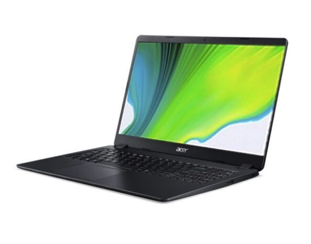

__Menggunakan Sistem Operasi Windows (Versi 10)__

### __Tentang Windows :__

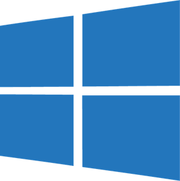

Microsoft Windows atau yang lebih dikenal dengan sebutan Windows saja adalah keluarga sistem operasi yang dikembangkan oleh Microsoft, dengan menggunakan antarmuka pengguna grafis (GUI).

Sistem operasi Windows telah berevolusi dari MS-DOS, sebuah sistem operasi yang berbasis modus teks dan command-line. Windows versi pertama, Windows Graphic Environment 1.0 pertama kali diperkenalkan pada 10 November 1983, tetapi baru keluar pasar pada bulan November tahun 1985, yang dibuat untuk memenuhi kebutuhan komputer dengan tampilan bergambar. Windows 1.0 merupakan perangkat lunak 16-bit tambahan (bukan merupakan sistem operasi) yang berjalan di atas MS-DOS (dan beberapa varian dari MS-DOS), sehingga ia tidak akan dapat berjalan tanpa adanya sistem operasi DOS. Versi 2.x, versi 3.x juga sama. Beberapa versi terakhir dari Windows (dimulai dari versi 4.0 dan Windows NT 3.1) merupakan sistem operasi mandiri yang tidak lagi bergantung kepada sistem operasi MS-DOS. Microsoft Windows kemudian bisa berkembang dan dapat menguasai penggunaan sistem operasi hingga mencapai 90%.

Versi-versi Windows :

- 16-bit, berjalan di atas MS-DOS
    - 1985 November - Windows 1.0
    - 1987 9 Desember - Windows 2.0
    - 1990 22 Mei - Windows 3.0
    - 1992 Agustus - Windows 3.1
    - 1992 Oktober - Windows for Workgroups 3.1
    - 1993 November - Windows for Workgroups 3.11 (Versi terakhir tanpa Menu Mulai)
- Hibrida (16-bit/32-bit), berjalan tanpa MS-DOS (meski tidak sepenuhnya)
    - 1995 24 Agustus - Windows 95 (Versi: 4.00.950) (Versi pertama dengan Menu Mulai)
    - 1998 25 Juni - Windows 98 (Versi: 4.1.1998)
    - 1999 5 Mei - Windows 98 Second Edition (Versi: 4.1.2222)
    - 2000 - Windows Millennium Edition (Me) (Versi: 4.9.3000)
- Berbasis kernel Windows NT
    - 1993 Agustus - Windows NT 3.1
    - 1994 September - Windows NT 3.5
    - 1995 Juni - Windows NT 3.51
    - 1996 29 Juli - Windows NT 4.0 (Versi 4.0.1381)
    - 2000 17 Februari - Windows 2000 (Versi: NT 5.0.2195)
    - 2001 - Windows XP (Versi: NT 5.1.2600)
    - 2003 - Windows Server 2003 (Versi: NT 5.2.3790)
    - 2006 - Windows Vista (Versi 6.0 Build 6000) (Versi pertama yang mendukung tema mode Aero)
    - 2007 - Windows Home Server (Versi 6.0.1800.24)
    - 2008 - Windows Server 2008 (Versi 6.0.6001)
    - 2009 22 Oktober - Windows 7 (Versi 6.1 Build 7600) (Versi terakhir dengan Menu Mulai) (Versi terakhir dengan tema mode Aero)
    - 2009 22 Oktober - Windows Server 2008 R2 (Versi 6.1.7600)
    - 2012 4 September - Windows Server 2012 (Versi 6.2 Build 9200)
    - 2012 26 Oktober - Windows 8 (Versi 6.2 Build 9200) (Versi pertama dengan Layar Mulai)
    - 2013 18 Oktober - Windows 8.1 (Versi 6.3 Build 9600) (Versi pertama dengan Tombol Mulai yang dimodifikasi)
    - 2013 18 Oktober - Windows Server 2012 R2 (Versi 6.3 Build 9600)
    - 2015 29 Juli - Windows 10 (Versi 10.0 Build 10240) (Versi pertama dengan Menu Mulai yang dimodifikasi)
    - 2016 - Windows Server 2016 (Versi 10.0 Build 14393)
    - 2019 - Windows Server 2019
    - 2021 - Windows 11 (Versi pertama dengan ikon Taskbar yang terpusat di tengah, serta menu mulai yang dimodifikasi.)
    - 2021 18 Agustus - Windows Server 2022

__Menggunakan Processor AMD Athlon Silver 3050U with Radeon Graphics 2.30 GHz__

- ### __Tentang AMD :__

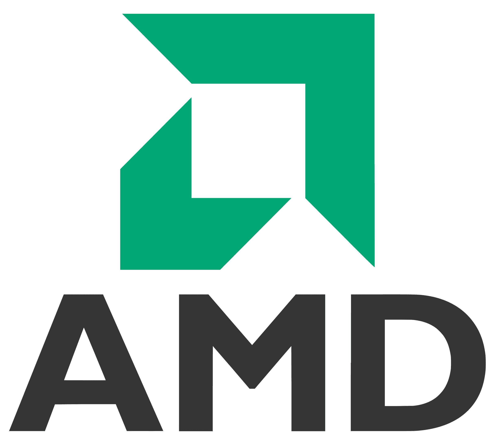

Advanced Micro Devices, Inc. (AMD) adalah perusahaan semikonduktor multinasional Amerika yang berbasis di Santa Clara, California, yang mengembangkan prosesor komputer dan teknologi terkait untuk bisnis dan pasar konsumen. Meskipun awalnya memproduksi prosesornya sendiri, perusahaan tersebut kemudian mengalihdayakan manufakturnya, sebuah praktik yang dikenal sebagai going fabless, setelah GlobalFoundries dipisahkan pada tahun 2009. Produk utama AMD meliputi mikroprosesor, chipset papan induk, prosesor tertanam dan prosesor grafis untuk peladen, workstation, komputer pribadi, dan aplikasi sistem tertanam.

__Software Yang Terinstall :__

1. Microsoft Office Home and Student 2019

    - Microsoft office sendiri merupakan aplikasi perangkat lunak yang dimanfaatkan untuk mengolah, menyimpan, dan mengombinasikan data berbentuk dokumen. Data yang dapat diolah yakni, data digital berupa huruf, gambar dan angka. Perangkat lunak ini memiliki peran khusus dalam bidang perkantoran. Hal-hal yang berhubungan dengan data perkantoran akan diolah serta disimpan secara singkat dan detail di dalam microsoft office.

2. Visual Studio Code

    - Visual Studio Code merupakan penyunting kode-sumber yang dapat digunakan untuk beragam bahasa pemrograman, termasuk Java, JavaScript, Go, Node.js, Python dan C++. Visual Studio Code memperkerjakan komponen penyunting yang sama (namakode "Monaco") yang digunakan di Azure DevOps (awalnya dippangil Visual Studio Online dan Visual Studio Team Services). Sebagai ganti dari sistem proyek, VSCode memungkinkan pengguna untuk membuka satu atau lebih banyak direktori, yang dapat disimpan di ruang kerja untuk digunakan ulang nanti. Ini memungkinkan untuk beroperasi sebagai penyunting kode languange-agnostic untuk semua bahasa. VSCode mendukung banyak bahasa pemrograman dan sekumpulan fitur yang berbeda dari setiap bahasa. Berkas dan map yang tidak diingikan dapat di kecualikan dari pohon proyek melalui pengaturan proyek tersebut. Kebanyakan fitur VSCode tidak di terekspos melalui menu atau tampilan pengguna tetapi dapat diakses melalui command palette.

3. Adobe Photoshop

    - Sebenarnya fungsi utama dari Adobe Photoshop hanyalah untuk aplikasi pengedit foto ataupun gambar dengan tipe raster atau bitmap. Namun sebagai aplikasi pengedit gambar, fungsi Photoshop dapat dijabarkan lebih khusus lagi, yaitu untuk mempercantik gambar, merekayasa gambar, dan membuat desain gambar. Fungsi Photoshop untuk mempercantik gambar yaitu dengan cara menghaluskan atau objek, dimana hal ini dilakukan agar gambar tersebut terlihat lebih menarik dan indah. Fungsi Photoshop juga untuk merekayasa gambar yaitu dengan cara merubah tampilan ataupun menggabungkan gambar-gambar yang berbeda agar gambar tersebut terlihat seperti gambar asli dan seringkali dapat menipu mata yang melihatnya. Dan fungsi Photoshop untuk membuat desain gambar yaitu dengan cara menciptakan objek baru seperti logo, brosur, spanduk, dan poster.

4. DLL

### __Macam-macam Hardware :__

__1. Mainboard atau Motherboard__

Motherboard adalah bagian komputer yang paling utama karena berisi sistem BIOS (Basic input output system) , pengatur koneksi input-output(chipset), soket prosessor, soket memory (RAM), soket kartu grafis (VGA card) dan soket kartu tambahan (additional cards seperti PCI, ISA). BIOS adalah bagian utama yang mengatur sistem input output pada komputer. Bagian yang termasuk input seperti : Keyboard dan mouse. Bagian yang termasuk output seperti Monitor dan printer.

__2. Processor (CPU)__

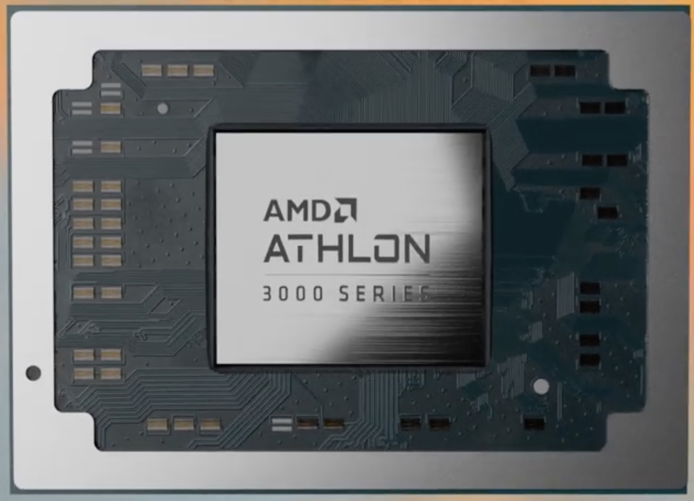

Prosessor adalah otak sentral dari sebuah komputer. Prosessor adalah yang mengerjakan semua perintah yang sudah terprogram dan disimpan dalam harddisk. Dalam prosessor dikenal istilah frekuensi clock, yaitu kecepatan sebuah prosessor untuk mengerjakan perintah program dalam satu detik. Satuan frekuensi Clock dinyatakan dalam Herts (Hz).

__3. Harddisk (HDD)__

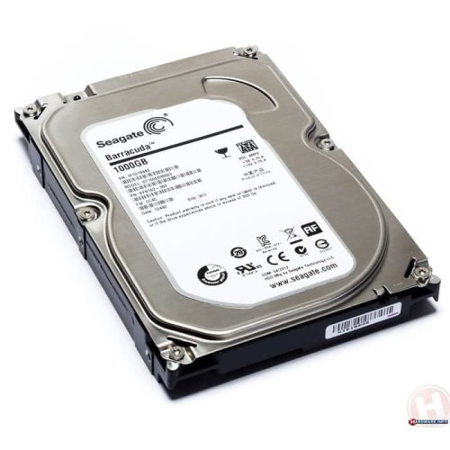

Harddisk adalah media penyimpanan data permanen, jadi data tidak hilang meskipun listrik sudah dimatikan. Harddisk berisi sebuah cakram magnetik yang mampu menyimpan data. Ukuran harddisk dinyatakan dalam Byte (B), contoh: 160GB (160 milyar byte). Harddisk ditemukan pertama kali oleh Reynold Johnson di tahun 1956. Harddisk pertama berukuran 4.4 MB. Sekarang dikenal dua macam harddisk yaitu ATA dan SATA (Serial ATA). Harddisk ATA mempunyai koneksi 40 pin dan Harddisk SATA hanya mempunyai koneksi 6 pin. Harddisk SATA lebih cepat dari Harddisk ATA, namun jika motherboardnya tidak mendukung koneksi SATA maka kita tidak bisa menggunakan harddisk SATA. Sekarang ukuran Harddisk sudah sangat besar, seperti 500GB, 750GB, dan 1000GB (1 TB – Terra Byte).

__4. RAM (Random Access Memory)__

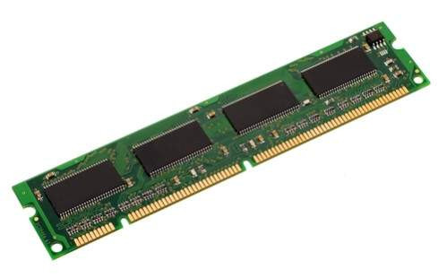

RAM adalah unit penyimpan data tidak permanen artinya data dalam RAM akan hilang jika listrik mati. Ukuran data RAM dinyatakan dengan Byte (B) dan kecepatan akses RAM dinyatakan dengan Hertz (Hz). Jadi dalam RAM tidak cuma data saja, namun ada parameter lain yaitu kecepatan RAM. Kecepatan RAM harus sesuai dengan spesifikasi soket RAM pada motherboard. Contoh: RAM 512MB PC667 mempunyai ukuran data 512MB dengan kecepatan akses 667 MHz.

__5. Optical drive (CD / DVD)__

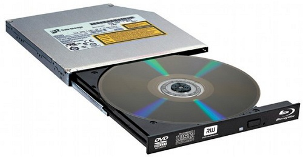

Optical Drive adalah alat pembaca untuk media penyimpan data berupa disk DVD / CD. DVD/ CD berupa kepingan cakram optik yang berisi data.

__6. VGA CARD (Kartu Grafis)__

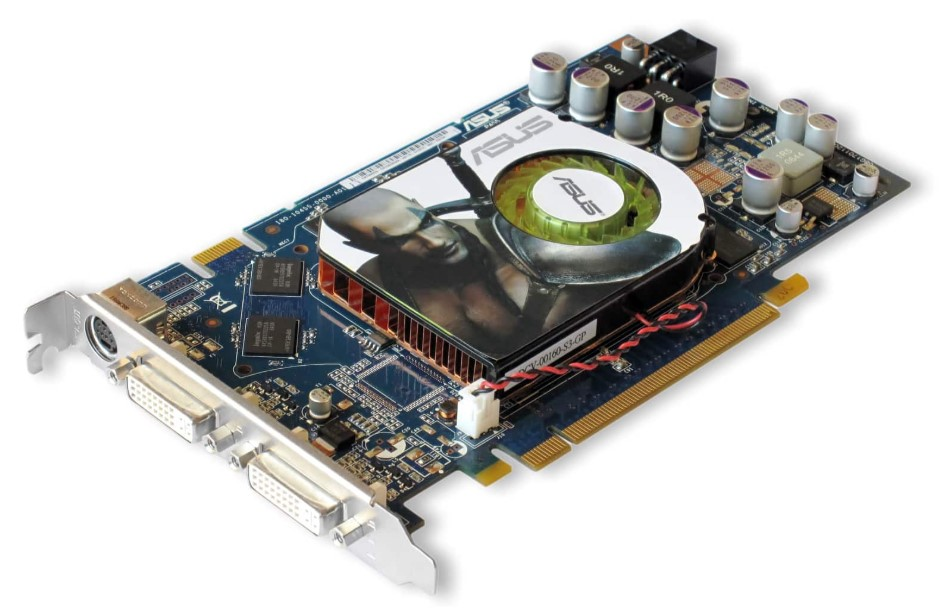

VGA adalah singkatan dari Video Graphics Array. VGA Card berfungsi mengeluarkan output grafis (gambar) untuk ditampilkan pada monitor. Ukuran VGA Card ditentukan dari ukuran RAM nya, semakin besar RAM sebuah VGA Card maka semakin halus gambar yang dihasilkan.

__7. Sound Card__

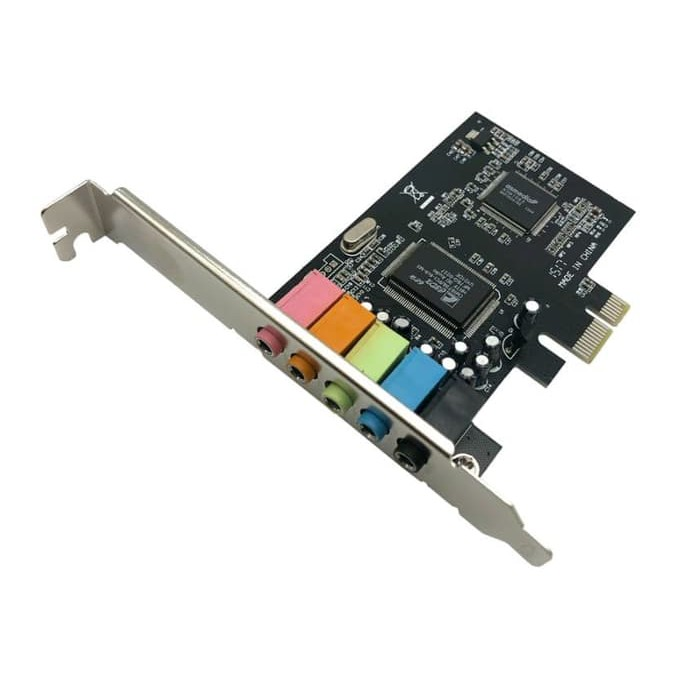

Sound Card adalah bagian yang mendekode data data digital menjadi sinyal suara. Dengan penemuan soundcard maka perkembangan dunia multimedia pada komputer menjadi makin meluas. Sound Card yang baik mampu menghasilkan suara dengan sampling yang rapat dan halus sehingga suara yang dihasilkan mendekati suara asli / Hi Fi (Hi Fi = High Fidelity) Contoh merk soundcard yang terkenal adalah Creative, Ess, Realtek, Cmedia, dll.

### __Penyimpanan Menggunakan SSD M.2 512gb__

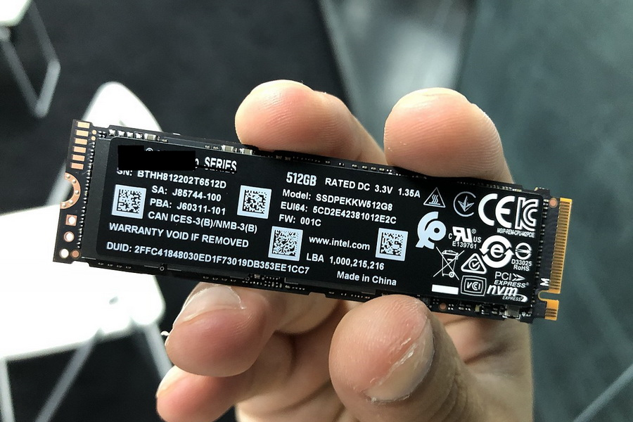

SSD adalah singkatan dari Solid State Drive. Teknologi ini kini sudah mulai menggantikan Hard Disk Drives (HDD). HDD adalah penyimpanan utama untuk komputer (baik desktop maupun laptop) yang telah ada sejak lama. Daya tarik utamanya adalah kapasitas penyimpanan yang tinggi dan biaya rendah. Solid-state drive (SSD) adalah perangkat penyimpanan generasi baru yang digunakan di komputer. SSD menggantikan hard disk mekanis tradisional dengan menggunakan memori berbasis flash, yang secara signifikan lebih cepat. Teknologi penyimpanan hard disk yang lebih lama berjalan lebih lambat, yang sering kali membuat komputer Anda berjalan lebih lambat dari yang seharusnya. SSD mempercepat komputer secara signifikan karena waktu akses baca yang rendah dan throughput yang cepat.

# Sejarah Perkembangan Komputer

__1. Generasi Pertama (1940-1959)__

Generasi pertama dimulai ketika komputer digunakan dalam akademi dan militer, seperti Komputer Atanasoff-Berry dibuat pada tahun 1937 untuk menyelesaikan sistem persamaan linear dan komputer Colossus untuk memecahkan kode rahasia Jerman Nazi. Kemudian, ENIAC yang dibangun pada tahun 1946 menjadi komputer pertama untuk tujuan umum. Ketika komputernya dinyalakan untuk pertama kali, Philadelphia mengalami mati listrik. Komputer generasi ini menggunakan tabung vakum untuk menyimpan data dan ukurannya memakan satu ruangan.

Ciri-ciri :
    
- Program dibuat dalam bahasa mesin.
- Menggunakan konsep storage program.
- Komponen yang digunakan adalah tabung hampa udara.
- Ukuran fisiknya besar, sehingga membutuhkan daya listrik yang besar.
- Dapat disimpan di magnetic tape dan magnetic disk.
- Contohnya komputer IBM 701 buatan tahun 1953 sebagai komputer komersial berukuran besar dan IBM 705 yang dibuat tahun 1959 untuk industri

__2. Generasi Kedua (1959-1965)__

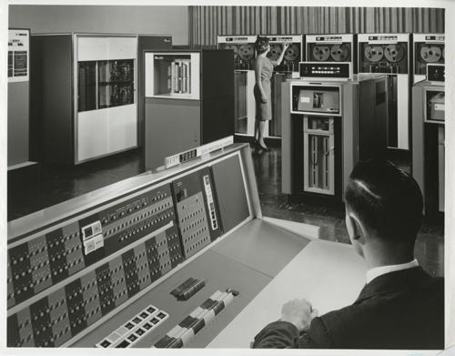

Generasi kedua dimulai ketika transistor menggatikan tabung vakum. UNIVAC diperkenalkan ke publik tahun 1951 untuk penggunaan komersial. Kemudian, pada tahun 1953, IBM memulai bisnis komputernya dengan merilis IBM 650 dan IBM 700. Berbagai bahasa pemrograman mulai dikembangkan dan komputer mulai memiliki memori dan sistem operasi.

Ciri-ciri:

- Kapasitas memori utama cukup besar.
- Komponen yang digunakan adalah transistor yang jauh lebih kecil dibandingkan tabung hampa udara.
- Menggunakan magnetic tape dan magnetic disk yang berbentuk removable disk.
- Mempunyai kemampuan proses real-time dan time sharing.
- Proses operasinya lebih cepat.
- Orientasinya pada aplikasi bisnis dan teknik.
- Contohnya komputer PDP-5 dan PDP-8 buatan tahun 1963 sebagai komputer mini komersial pertama. Selain itu ada pula komputer IBM 7070, IBM 1400, NCR 300, dan sebagainya.

__3. Generasi Ketiga (1965-1970)__

Generasi ketiga dimulai ketika teknologi transistor meningkat menjadi sirkuit terpadu. Komputer mini adalah inovasi yang signifikan dalam generasi ini dan mempengaruhi generasi komputer selanjutnya. NASA menggunakan komputer generasi ini untuk melancarkan Program Apollo, seperti Komputer Bimbingan Apollo untuk mempermudah kendali Apollo Command/Service Module. Digital Equipment Corporation menjadi perusahaan komputer nomor dua di belakang IBM dengan komputer PDP dan VAX-nya. Komputer ini membawa ke pengembangan sistem operasi yang berpengaruh, Unix.

   Ciri-ciri :

   - Komponen yang dipakai adalah IV (Integrated Circuits) yang terdiri atas ratusan atau ribuan transistor berbentuk hybrid integrated circuits dan monolithic integrated circuits.
   - Proses operasinya jauh lebih cepat dan lebih tepat, kapasitas memori komputer jauh lebih besar.
   - Ukuran fisik jauh lebih kecil sehingga penggunaan listrik lebih hemat.
   - Menggunakan magnetic disk yang sifatnya random access.
   - Dapat melakukan multiprocessing dan multiprogramming.
   - Alat input-output mengalami pengembangan dengan menggunakan visual display terminal.
   - Dapat melakukan komunikasi data dari satu komputer dengan komputer lainnya.
   - Contohnya komputer IBM S/30. NOVA, CDC 3000, PDP-11, dan sebagainya.

__4. Generasi Keempat (dimulai tahun 1970)__

Generasi keempat dimulai pada dasawarsa 1970-an ketika penemuan MOSFET dan integrasi berskala besar selanjutnya membawa ke pengembangan mikroprosesor di awal 1970-an. komputer pribadi yang semakin kecil berkat mikroprosesor mulai berkembang, dimulai dari komputer rumahan dan komputer meja. Teknologi selanjutnya adalah laptop dan ponsel cerdas yang sangat fenomenal, membawa berbagai perusahaan teknologi ke dalam perang paten atas ponsel cerdas.

   Ciri-ciri :

   - Penggunaan LSI (Large Scale Integration) yang disebut juga sebagai Bipolar Large Scale Integration.
   - Menggunakan mikroprosesor dan semikonduktor yang berbentuk chip untuk memori komputer.
   - Contohnya, komputer IBM 370 menggunakan Intel 4004 mikroprosesor yang dikembangkan pertama kali pada tahun 1971 oleh perusahaan Intel Corporation dengan menggunakan chip mikroprosesor.
   - Personal computer atau PC mulai berkembang sejak tahun 1977. Contohnya komputer Apple II dan komputer dekstop oleh Xerox Corporation.
   - Pada tahun 1981, komputer mulai banyak menggunakan sistem Window dan mouse.

__5. Generasi Kelima__

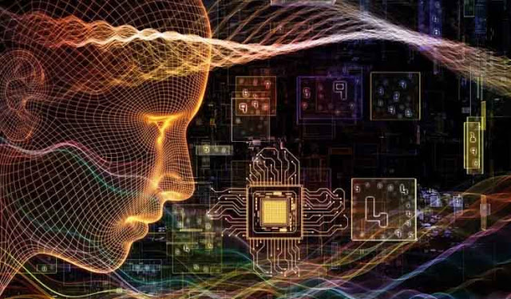

Generasi kelima digadang-gadang sebagai tahapan perkembangan teknologi paling canggih saat ini dan diciptakan pertama kali pada tahun 1980-an. Peningkatan dari segi visualisasi, menjadikan tampilan visual pada komputer di generasi kelima mempunyai resolusi sangat tinggi dan begitu tajam. Negara yang mempelopori sejarah perkembangan komputer pada generasi kelima adalah Jepang. Dalam proses pengembangannya, terdapat penambahan komponen-komponen penting ke dalam sistem komputer modern saat ini. Hal ini dikarenakan komponen yang digunakan pada komputer generasi kelima adalah menerapkan ragam teknologi modern, seperti superkonduktor, ULSI, dan kecerdasan buatan (atau kalian lebih mengenalnya dengan sebutan Artificial Intelligence).

   Ciri-ciri :

   - Komponen yang dipakai adalah VLSI (Very Large Scale Integration).
   - Kemampuan komputer dikembangakan untuk memecahkan masalah sendiri dengan bantuan AI (Artificial Intelligence). AI dapat diterapkan untuk mengoperasikan robot.
   - Mulai dikembangkan komputer yang dapat menggantikan chip.
   - Jepang adalah negara yang memelopori komputer generasi kelima.

