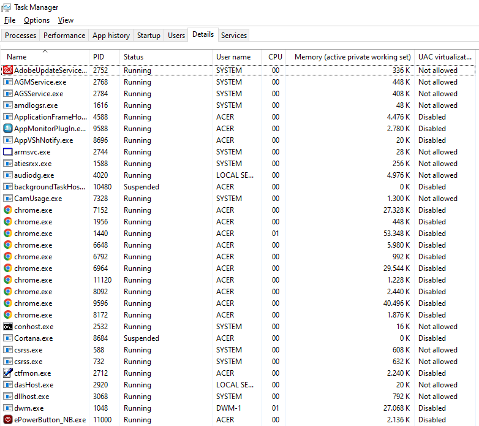
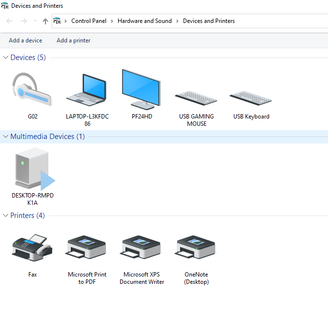
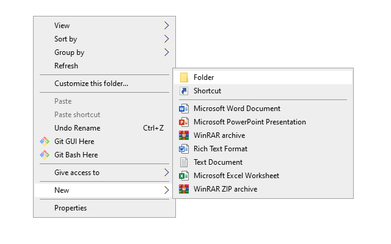
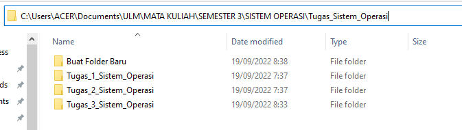
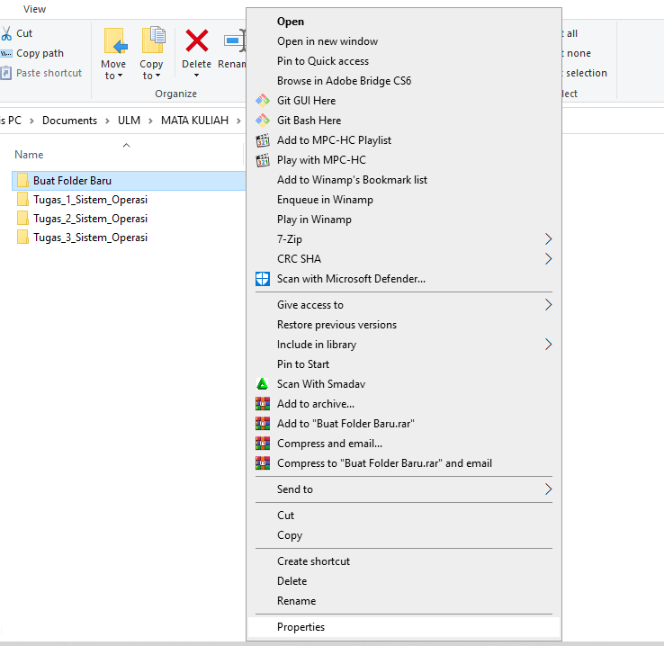
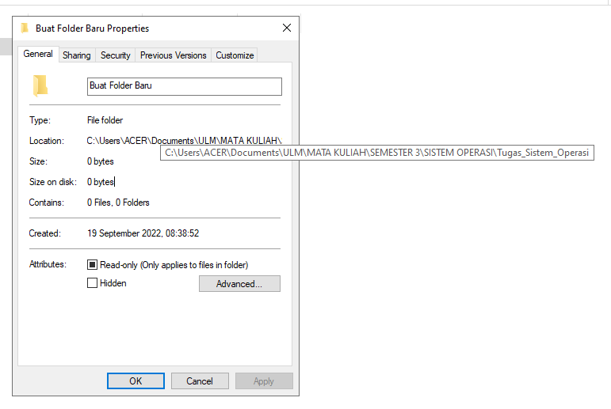

## __Tugas 3__
### __Khoyrur Roykhan (2110131210002)__
 

### __1. Komponen Sistem Operasi__
- __Manajemen Proses__
    
    Task Manager di bagian user pada windows menampilkan proses yang sedang berjalan di komputer, dan dapat di hentikan.
        
    Contoh :
    

- __Manajemen Sistem Masukan dan Keluaran__

    _Control Panel/Hardware and Sound/Device and Printers_ pada windows menampilkan devices I/O yang terhubung pada perangkat komputer.

    Contoh :
    

- __Manajemen Sistem Berkas__

    Contoh dari Manajemen Sistem Berkas adalah membuat/menghapus folder dan representasi jalur menuju berkas tersebut.

    Contoh :

    untuk membuat folder baru bisa melakukannya dengan cara _klik kanan -> new -> Folder_, seperti pada gambar dibawah.

    

    jalur untuk menuju folder tersebut bisa dilihat dari bar address yang ada di bagian atas pada file explorer, seperti pada gambar di bawah ini :

    

    atau bisa juga dengan cara _klik kanan pada berkas -> propersies ->_ dibagian _general_ akan ada _location_ yang menampilkan lokasi dari berkas tersebut. seperti contoh pada gambar dibawah ini:

    

    

    
