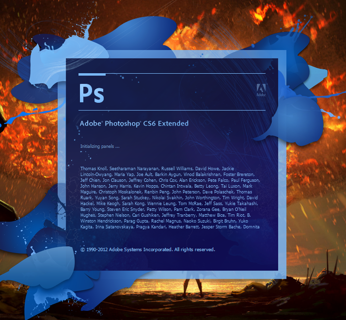

## __Tugas 3__
### __Khoyrur Roykhan (2110131210002)__
 

### __1. Komponen Sistem Operasi__
- __Manajemen Proses__
    
    Task Manager di bagian user pada windows menampilkan proses yang sedang berjalan di komputer, dan dapat di hentikan.
        
    Contoh :
    

- __Manajemen Sistem Masukan dan Keluaran__

    _Control Panel/Hardware and Sound/Device and Printers_ pada windows menampilkan devices I/O yang terhubung pada perangkat komputer.

    Contoh :
    

- __Manajemen Sistem Berkas__

    Contoh dari Manajemen Sistem Berkas adalah membuat/menghapus folder dan representasi jalur menuju berkas tersebut.

    Contoh :

    untuk membuat folder baru bisa melakukannya dengan cara _klik kanan -> new -> Folder_, seperti pada gambar dibawah.

    

    jalur untuk menuju folder tersebut bisa dilihat dari bar address yang ada di bagian atas pada file explorer, seperti pada gambar di bawah ini :

    

    atau bisa juga dengan cara _klik kanan pada berkas -> propersies ->_ dibagian _general_ akan ada _location_ yang menampilkan lokasi dari berkas tersebut. seperti contoh pada gambar dibawah ini:

    

    

 

### __2. Layanan Sistem Operasi__

- __Manipulasi Sistem Berkas__

    Contoh pada Layanan SO Manipulalsi Sistem Berkas adalah saat kita membuat sebuah file atau menghapus file, misal :
    
    membuat file notepad
    

    kemudian kita dapat melihat kapan file tersebut di buat / modifikasi / akses dibagian _properties -> General_

    

    kemudian kita dapat memodifikasi isi file tersebut .
    

    Setelah kita modifikasi maka informasi dari genral akan berubah juga sesuai waktu kita memodifikasi dan akses fie tersebut.

    

- __Eksekusi Program__

    Ketika kita menjalankan program sistem akan me-load program tersebut ke memori, contohnya saat kita membuka aplikasi Visual Studio Code maka sistem bisa menampilkan berapa memori yang di gunakan untuk menjalankan program tersebut.
    
    

- __Deteksi Eror__

    Contoh deteksi eror adalah saat kita menganti nama file atau memindahkan file yang sedang berjalan, misal kita membuka file ppt dan kita ingin mengganti nama file tersebut namun file tersebut masih tetap terbuka, maka akan muncul laporan kesalahan dan pesannya.

    

 

### __3. System Call__

- __Informasi dan Pemeliharaan__

    Contohnya adalah meminta sistem untuk menampilkan jumlah memori penyimpanan yang telah digunakan dan yang masih bisa digunakan.

    

- __Manajemen Proses__

    Contohnya adalah saat membuka aplikasi Adobe Photoshop maka sistem juga akan meload fitur-fitur yang ada directori penyimpanan aplikasi tersebut, seperti ekstensi tambahan yang ada di photoshop.

    

- __Manajemen Sistem Berkas__

    Contoh dari System Call Manajemen Sistem Berkas adalah mengubah atribut berkas, misal kita merubah nama berkas dengan _klik kanan -> rename_.

    

    

