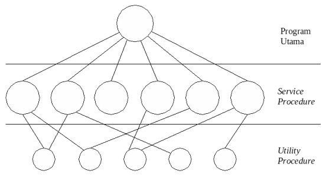
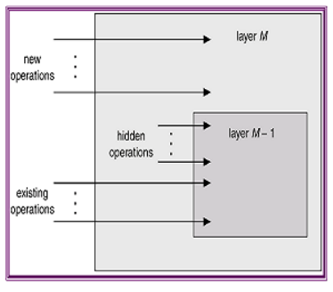
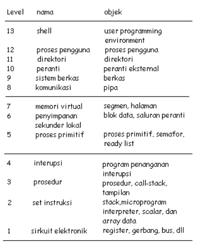
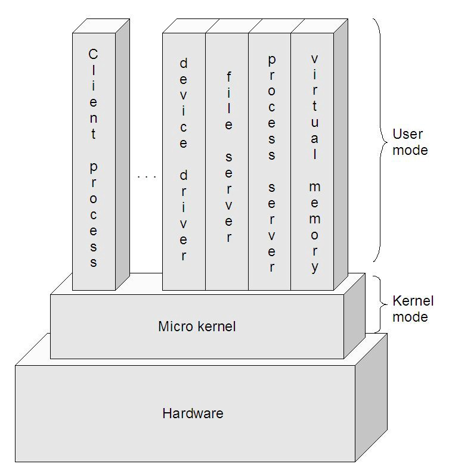

<h1 align="center"><b>Struktur Sistem Operasi</b></h1>

&ensp;&ensp;&ensp;&ensp;Struktur sistem operasi merupakan komponen- komponen sistem operasi yang dihubungkan dan dibentuk di dalam kernel. Ada beberapa struktur sistem operasi yang pernah dicoba, diantaranya sebagai berikut:

 

### __A. SISTEM MONOLITIK (Struktur Sederahana)__

&ensp;&ensp;&ensp;&ensp;Sistem monolitik merupakan struktur sistem operasi sederhana yang dilengkapi dengan operasi “dual” pelayanan {sistem call} yang diberikan oleh sistem operasi. Model sistem call dilakukan dengan cara mengambil sejumlah parameter pada tempat yang telah ditentukan sebelumnya, seperti register atau stack dan kemudian mengeksekusi suatu intruksi trap tertentu pada monitor mod

<i>Gambar Model struktur monolitik sistem operasi</i>

&ensp;&ensp;&ensp;&ensp;Pada model ini, tiap-tiap sistem call memiliki satu service procedure. Utility procedure mengerjakan segala sesuatu yang dibutuhkan oleh beberapa service procedure, seperti mengambil data dari user program.

&ensp;&ensp;&ensp;&ensp;Mekanisme dan prinsip kerja model struktur monolitik sistem operasi ini adalah sebagai berikut:

1. User program melakukan “trap” pada karnel
2. Intruksi berpindah dari user mode ke monitor mode dan mentransfer control ke sistem operasi.
3. Sistem operasi mengecek parameter — parameter dari pemanggilan tersebut, untuk menentukan sistem call mana yang memanggil.
4. Sistem operasi menunjuk ke suatu table yang berisi slot ke-k yang menunjuk sistem call K (Kontrol).
5. Kontrol akan dikembalikan kepada user program, jika sistem call telah selesai mengerjakan tugasnya.

&ensp;&ensp;&ensp;&ensp;Tatanan ini memberikan suatu struktur dasar dari sistem operasi sebagai berikut :

- Program utama meminta service procedure.
- Kumpulan service procedure yang dibaca oleh sistem call.
- Kumpulan utility procedure yang membantu service procedure.

### __Kegunggulan Sistem Monolik (Struktur Sederhana)__

1. Layanan pada satu ruang alamat memory.terhadap job-job yang ada bisa dilakukan dengan cepat karena berada

### __Kelemahan Sistem Monolik (Struktur Sederhana)__

1. Pengujian dan penghilangan kesalahan sulit dilakukan karena tidak dapat dipisahkan dan dilokasikan.
2. Sulit dalam menyediakan fasilitas pengamanan. Kurang efisien dalam penggunaan memori dimana setiap computer harus menjalankan kernel yang besar sementara tidak memerlukan seluruh layanan yang disediakan kernel.
3. Kesalahan pemrograman di satu bagian kernel menyebakan matinya seluruh system.

 

### __B. PENDEKATAN BERLAPIS__

&ensp;&ensp;&ensp;&ensp;Sistem operasi dibagi menjadi sejumlah lapisan yang masing-masing dibangun diatas lapisan yang lebih rendah. Lapisan yang lebih rendah menyediakan layanan untuk lapisan yang lebih tinggi. Lapisan yang paling bawah adalah perangkat keras, dan yang paling tinggi adalah user-interface.

<i>Lapisan pada Sistem Operasi</i>

&ensp;&ensp;&ensp;&ensp;Sebuah lapisan adalah implementasi dari obyek abstrak yang merupakan enkapsulasi dari data dan operasi yang bisa memanipulasi data tersebut. Keuntungan utama dengan sistem ini adalah modularitas. Pendekatan ini mempermudah debug dan verifikasi sistem. Lapisan pertama bisa di debug tanpa mengganggu sistem yang lain karena hanya menggunakan perangkat keras dasar untuk implementasi fungsinya. Bila terjadi error saat debugging sejumlah lapisan, error pasti pada lapisan yang baru saja di debug, karena lapisan dibawahnya sudah di debug.

&ensp;&ensp;&ensp;&ensp;Sedangkan menurut Tanenbaum dan Woodhull, sistem terlapis terdiri dari enam lapisan, yaitu:

- Lapisan 0

    
Mengatur alokasi prosesor, pertukaran antar proses ketika interupsi terjadi atau waktu habis. Lapisan ini mendukung dasar multi-programming pada CPU.

- Lapisan 1

    
Mengalokasikan ruang untuk proses di memori utama dan pada 512 kilo word drum yang digunakan untuk menahan bagian proses ketika tidak ada ruang di memori utama.

- Lapisan 2

    
Menangani komunikasi antara masing-masing proses dan operator console. Pada lapis ini masing-masing proses secara efektif memiliki opertor console sendiri.

- Lapisan 3

    
Mengatur peranti M/K dan menampung informasi yang mengalir dari dan ke proses tersebut.

- Lapisan 4

    
Tempat program pengguna. Pengguna tidak perlu memikirkan tentang proses, memori, console, atau managemen M/K.

- Lapisan 5 

    Merupakan operator sistem.

Menurut Stallings, model tingkatan sistem operasi yang mengaplikasikan prinsip ini dapat dilihat pada tabel berikut, yang terdiri dari level-level dibawah ini:

- Level 1

    
Terdiri dari sirkuit elektronik dimana obyek yang ditangani adalah register memory cell, dan gerbang logika. Operasi pada obyek ini seperti membersihkan register atau membaca lokasi memori.

- Level 2

    
Pada level ini adalah set instruksi pada prosesor. Operasinya adalah instruksi bahasa-mesin, seperti menambah, mengurangi, load dan store.

- Level 3

    
Tambahan konsep prosedur atau subrutin ditambah operasi call atau return.

- Level 4

    
Mengenalkan interupsi yang menyebabkan prosesor harus menyimpan perintah yang baru dijalankan dan memanggil rutin penanganan interupsi.

Empat level pertama bukan bagian sistem operasi tetapi bagian perangkat keras. Meski pun demikian beberapa elemen sistem operasi mulai tampil pada level-level ini, seperti rutin penanganan interupsi. Pada level 5, kita mulai masuk kebagian sistem operasi dan konsepnya berhubungan dengan multi-programming.

- Level 5

    
Level ini mengenalkan ide proses dalam mengeksekusi program. Kebutuhan-kebutuhan dasar pada sistem operasi untuk mendukung proses ganda termasuk kemampuan men-suspend dan me-resume proses. Hal ini membutuhkan register perangkat keras untuk menyimpan agar eksekusi bisa ditukar antara satu proses ke proses lainnya.

- Level 6

    
Mengatasi penyimpanan sekunder dari komputer. Level ini untuk menjadualkan operasi dan menanggapi permintaan proses dalam melengkapi suatu proses.

- Level 7

    
Membuat alamat logik untuk proses. Level ini mengatur alamat virtual ke dalam blok yang bisa dipindahkan antara memori utama dan memori tambahan. Cara-cara yang sering dipakai adalah menggunakan ukuran halaman yang tetap, menggunakan segmen sepanjang variabelnya, dan menggunakan cara keduanya. Ketika blok yang dibutuhkan tidak ada dimemori utama, alamat logis pada level ini meminta transfer dari level 6.

Sampai point ini, sistem operasi mengatasi sumber daya dari prosesor tunggal. Mulai level 8, sistem operasi mengatasi obyek eksternal seperti peranti bagian luar, jaringan, dan sisipan komputer kepada jaringan.

- Level 8 

    
Mengatasi komunikasi informasi dan pesan-pesan antar proses. Dimana pada level 5 disediakan mekanisme penanda yang kuno yang memungkinkan untuk sinkronisasi proses, pada level ini mengatasi pembagian informasi yang lebih banyak. Salah satu peranti yang paling sesuai adalah pipe (pipa) yang menerima output suatu proses dan memberi input ke proses lain.

- Level 9 

    
Mendukung penyimpanan jangka panjang yang disebut dengan berkas. Pada level ini, data dari penyimpanan sekunder ditampilkan pada tingkat abstrak, panjang variabel yang terpisah. Hal ini bertentangan tampilan yang berorientasikan perangkat keras dari penyimpanan sekunder.

- Level 10

    
Menyediakan akses ke peranti eksternal menggunakan antarmuka standar.

- Level 11

    
Bertanggung-jawab mempertahankan hubungan antara internal dan eksternal identifier dari sumber daya dan obyek sistem. Eksternal identifier adalah nama yang bisa dimanfaatkan oleh aplikasi atau pengguna. Internal identifier adalah alamat atau indikasi lain yang bisa digunakan oleh level yang lebih rendah untuk meletakkan dan mengontrol obyek.

- Level 12

    
Menyediakan suatu fasilitator yang penuh tampilan untuk mendukung proses. Hal ini merupakan lanjutan dari yang telah disediakan pada level 5. Pada level 12, semua info yang dibutuhkan untuk managemen proses dengan berurutan disediakan, termasuk alamat virtual di proses, daftar obyek dan proses yang berinteraksi dengan proses tersebut serta batasan interaksi tersebut, parameter yang harusdipenuhi proses saat pembentukan, dan karakteristik lain yang mungkin digunakan sistem operasi untuk mengontrol proses.

- Level 13

    
Menyediakan antarmuka dari sistem operasi dengan pengguna yang dianggap sebagai shell atau dinding karena memisahkan pengguna dengan sistem operasi dan menampilkan sistem operasi dengan sederhana sebagai kumpulan servis atau pelayanan.

### __Kelebihan Sistem Berlapis__

1. Memiliki rancangan modular, yaitu sistem dibagi menjadi beberapa modul & tiap modul dirancang secara independen.
2. Pendekatan berlapis menyederhanakan rancangan, spesifikasi dan implementasi sistem operasi.

### __Kelemahan Sistem Berlapis__

1. Fungsi-fungsi sistem operasi diberikan ke tiap lapisan secara hati-hati.

 

### __C. KERNEL MIKRO (MIKROKERNEL)__

<i>Struktur Mikrokernel</i>

&ensp;&ensp;&ensp;&ensp;Metode struktur ini adalah menghilangkan komponen-komponen yang tidak diperlukan dari kernel dan mengimplementasikannya sebagai sistem dan program-program level user. Hal ini akan menghasilkan kernel yang kecil.

&ensp;&ensp;&ensp;&ensp;Fungsi utama dari jenis ini adalah menyediakan fasilitas komunikasi antara program client dan bermacam pelayanan yang berjalan pada ruang user.

&ensp;&ensp;&ensp;&ensp;Sistem operasi yang menggunakan micro kernel umumnya secara dramatis memiliki kinerja di bawah kinerja sistem operasi yang menggunakan monolithic kernel. Hal ini disebabkan oleh adanya overhead yang terjadi akibat proses input/output dalam kernel yang ditujukan untuk mengganti konteks (context switch) untuk memindahkan data antara aplikasi dan server.

Contoh Sistem operasi yang menggunakan struktur ini adalah : TRU64 UNIX, MacOSX dan QNX.

### __Kelebihan Kernel Mikro__

1. kemudahan dalam memperluas sistem operasi
2. Mudah untuk diubah ke bentuk arsitektur baru
3. Kode yang kecil dan lebih aman

### __Kekurangan Kernel Mikro__

1. kinerja akan berkurang selagi bertambahnya fungsi- fungsi yang digunakan.